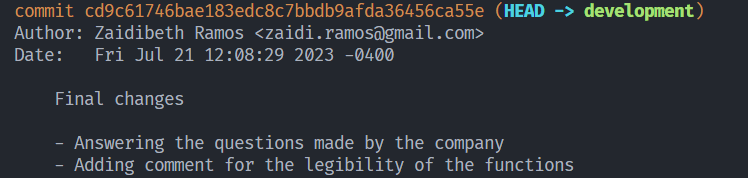
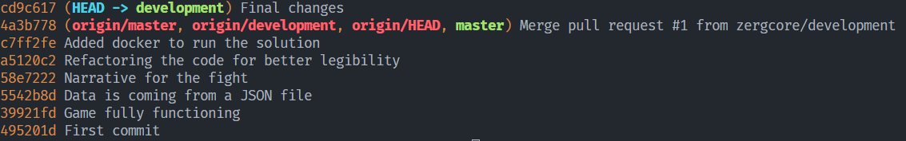
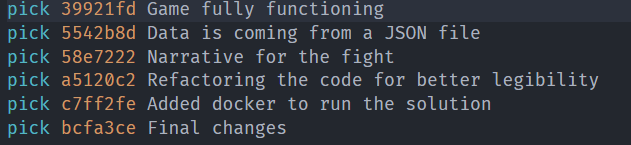
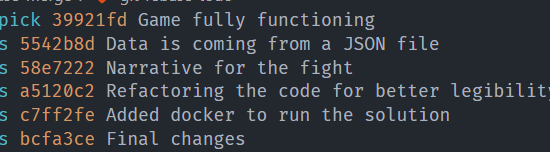

1. **Supongamos que en un repositorio GIT hiciste un commit y olvidaste un archivo. Explica cómo se
   soluciona si hiciste push, y cómo si aún no hiciste. De ser posible, que quede solo un commit
   con los cambios.**

   ##### Digamos que hice un commit de ciertos archivos, y en uno de los archivos necesito tener la fecha exacta de cuando se hizo el commit donde estoy añadiendo este archivo. ¿Cómo hago para añadir esta modificación en un archivo sin crear otro commit?

   Una vez hecho el commit con

   `git add .`

   `git commit "Mensaje describiendo los cambios hechos en el commit"`

   Verifico la fecha y hora exacta del commit, y la copio y pego en el archivo. Dicha fecha es verificable con

   `git log`

   

   En este caso, dicha fecha y hora exacta sería Fri Jul 21 12:08:29 2023 -0400

   Una vez se hagan todos los cambios, se añaden los archivos que se desean incluir o todos los archivos a staging nuevamente con

   `git add .`

   y luego se añaden al commit que se encuentra en el HEAD con

   `git commit --amend`

   Dado el caso que se quiera modificar tambien el mensaje, y dado el caso que no

   `git commit --amend --no-edit`

   ##### Digamos que se olvidaron varios cambios, por lo que se hicieron varios commits, y no se enviaron al repositorio remoto sino que se mantuvieron en el repositorio local. Y se desea convertir dichos commits en un unico commit antes de enviar los cambios al repositorio remoto.

   En primer lugar hacemos git log o git log --oneline para verificar más claramente la historia de los commits.

   

   Copiamos el commit anterior al commit a partir del cual se desea combinar, es decir. Si se quieren combinar por ejemplo todos los commits luego del first commit, se debe copiar el first commit. Por lo que lo que se debe copiar es 495201d
   Luego, el comando que nos permite combinar *commits* es `git rebase --interactive ${id-del-commit`} o `git rebase -i ${id-del-commit}` donde `id-del-commit `es el commit copiado previamente.

   `git rebase -i 495201d`

   
   Una vez  ejecutado el commando, git abre un archivo el cual se debe seleccionar todos los que se quieren comprimir cambiando la palabra pick por squash o s eligiendo solo el primero
   

   Se guarda dicho archivo modificado. A continuación, se abre un nuevo editor que contiene por defecto los mensajes de *commit* de los *commits* que van a combinarse en uno solo al ejecutar el  *rebase* . Es posible editar el mensaje del commit de manera que siga un estandar respecto al resto de los commits del repositorio.

   ##### Digamos que se hicieron varios commits, y no se sabe usar `git rebase + squash` por cualquier motivo, además de que hay cambios en una rama remota utilizada solamente por ti para añadir los cambios. Hay otra forma, pero es una muy mala práctica.

   Digamos que la rama actual se llama development-zergcore y en el repositorio remoto hay una rama del mismo nombre que es donde se almacenan los cambios cuando se hace push.

   En primer lugar, estando en la rama actual, se crea una rama llamada, por ejemplo, backup-development-zergcore para respaldar los cambios en la rama actual hechos hasta el momento con el comando
   `git branch backup-development-zergcore`

   Luego, en la rama actual, se obtienen los commits de la rama con git log, y se busca el id del commit anterior al de todos los cambios que se quieren unir en uno solo, tomando el ejemplo anterior, puede ser *495201d*
   Una vez se ha determinado el id, en la rama actual se hace `git reset --mixed {id-del-commit}`
   `git reset --mixed 495201d `

   Este commit hace que todos los archivos modificados o nuevos en los commits anteriores queden en el espacio de trabajo. Se añaden al staging y se hace un nuevo commit con todos los cambios juntos.

   `git add .`
   `git commit -m "Mensaje descriptivo de acuerdo al commit con todos los cambios añadidos"`

   Hasta este momento, todos los cambios estan en el repositorio local, y no hay absolutamente nada de esto en el repositorio remoto. Además, si quisiera hacer push habrían conflictos pues la historia esta desfasada respecto a la historia en el repositorio remoto. Para evitar lidiar con conflictos, como la rama en el repositorio remoto solo está siendo usada por el mismo desarrollador para sus propios cambios, y dicha rama es una copia de la rama en el repositorio local, se puede eliminar la rama
   `git push -d origin development-zergcore`

   Y luego, se vuelven a enviar todos los cambios con los cambios en la historia con
   `git push origin development-zergcore`

   Ahora, todos los commits seleccionados se han comprimido en un único commit, y actualmente están en el repositorio remoto.
   Dado el caso que todo haya salido bien se puede eliminar la rama backup con el comando
   **`git branch -d backup-development-zergcore`**
2. **Si has trabajado con control de versiones ¿Cuáles han sido los flujos con los que has trabajado?**

   Durante mi trayectoria en el desarrollo de proyectos, he adquirido experiencia en distintos flujos de trabajo con Git. Al principio, mientras estudiaba en la universidad y en proyectos personales para mejorar mis habilidades, utilicé el conocido Single-Branch Workflow.

   Además, en mis experiencias laborales anteriores, me encontré trabajando con un enfoque que combinaba aspectos del Feature Branch Workflow y el Release Flow. En este caso, las ramas principales eran master, development y release. Para desarrollar nuevas funcionalidades, creábamos ramas derivadas de development, y una vez que la funcionalidad estaba estable, se fusionaba de vuelta en development. Posteriormente, después de ser sometida a pruebas exhaustivas y validaciones, se llevaba a master. Cuando había un conjunto de funcionalidades listas para ser lanzadas, se agrupaban en un release y se implementaban en producción.

   Asimismo, he tenido la oportunidad de utilizar el conocido flujo GitFlow, al cual le agregamos una rama adicional llamada Staging. Esta rama tuvo un propósito clave, ya que permitía realizar pruebas beta por parte del cliente en un entorno de producción destinado a esto, previo al lanzamiento.

   Estas diversas experiencias me han permitido comprender la importancia de adoptar flujos de trabajo bien estructurados y adaptarlos según las necesidades específicas de cada proyecto. El manejo adecuado de las ramas y los entornos de pruebas es esencial para garantizar un desarrollo eficiente y seguro, asegurando que las funcionalidades sean entregadas en su máxima calidad a los usuarios finales.
3. **¿Cuál ha sido la situación más compleja que has tenido con esto?**

   En una ocasión, me encontré frente a un desafío en un servidor con recursos limitados, donde tanto los contenedores de producción como los de prueba se ejecutaban en el mismo entorno. Esto generaba un problema, ya que el sistema en producción experimentaba una disminución en su rendimiento debido a la acumulación de deuda técnica y los recursos escasos disponibles. Como resultado, los usuarios experimentaban una experiencia de baja calidad.

   Para abordar esta situación, inicialmente implementamos una solución provisional. Optamos por apagar los contenedores de prueba durante los días de semana, de manera que solo realizábamos las pruebas durante los fines de semana cuando el tráfico en la plataforma era menor.

   Sin embargo, reconociendo la necesidad de una solución más sólida, decidimos adoptar una estrategia a largo plazo. Desarrollamos cronjobs que se encargaban de limpiar los datos no esenciales en la base de datos de forma periódica. Esta medida permitía mantener el sistema limpio y optimizado, lo que a su vez mejoraba significativamente su velocidad y capacidad de respuesta.

   Esta experiencia me enseñó la importancia de abordar los desafíos técnicos con una mentalidad proactiva y orientada a soluciones. Al implementar mejoras significativas en la gestión de recursos y la optimización del sistema, logramos brindar una experiencia de usuario más satisfactoria y garantizar el rendimiento óptimo del entorno de producción.
4. **¿Qué experiencia has tenido con los microservicios?**

   En mi experiencia con Fundación AmbLeMa, tuve la oportunidad de trabajar con una arquitectura cercana a microservicios, donde el sistema estaba dividido en cuatro proyectos independientes, cada uno de ellos ejecutándose en contenedores individuales.

   El primero de estos contenedores albergaba la base de datos, garantizando una gestión eficiente de los datos. El segundo se dedicaba al backend, proporcionando funcionalidades clave para el sistema. Por otro lado, contábamos con un contenedor para el backoffice del frontend, brindando una interfaz amigable para la gestión de la plataforma. Finalmente, el cuarto contenedor albergaba el frontend propiamente dicho, ofreciendo la aplicación web a los usuarios.

   La utilización de microservicios en esta implementación nos brindó una solución altamente eficiente, permitiendo una gestión más efectiva de los recursos y una mayor agilidad para adaptarnos a las necesidades cambiantes de la organización.
5. **¿Cuál es tu servicio favorito de GCP o AWS? ¿Por qué?**

   Mi servicio favorito de GCP sería Google Cloud Functions. Esta plataforma de computación sin servidor me permite ejecutar código en respuesta a eventos específicos sin preocuparme por la infraestructura. Mis razones:

   1. Escalabilidad automática: Google Cloud Functions escala automáticamente según la carga de trabajo, lo que significa que puedo manejar rápidamente cambios en el tráfico sin preocuparme por administrar servidores.
   2. Costo eficiente: Como no se gestiona un servidor, solo pago por la cantidad exacta de recursos utilizados durante la ejecución de la función.
   3. Integración con servicios de Google: Puedo aprovechar otros servicios de GCP para construir aplicaciones más robustas y escalables.
   4. Soporte para Python: Me permite escribir y desplegar fácilmente funciones utilizando mi lenguaje de programación preferido.
   5. Facilidad de uso: Su interfaz es intuitiva y fácil de usar, me permite desarrollar rápidamente y enfocarme en la lógica de la aplicación en lugar de la infraestructura.

   En general, Google Cloud Functions se adapta bien a mi conjunto de habilidades, preferencias técnicas y necesidades de desarrollo, lo que lo convierte en mi servicio favorito de GCP. Sin embargo, también reconozco que cada proyecto tiene sus requisitos únicos y podría considerar otros servicios de GCP o AWS dependiendo del caso.
